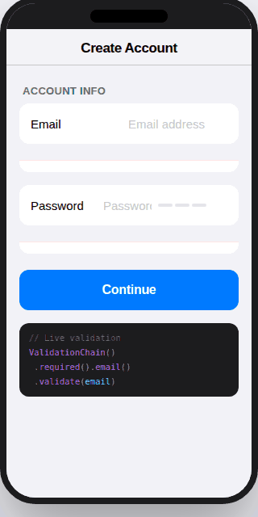

[](https://swiftpackageindex.com/ErsanQ/ValidatorKit)
[](https://swiftpackageindex.com/ErsanQ/ValidatorKit)
# ValidatorKit

<p align="center">
  
  
  
  
  
</p>

<p align="center">
  Declarative form validation for Swift. Clean, composable, and SwiftUI-ready.
</p>

---

<p align="center">
  
</p>

---

## Features

- ✅ Fluent chain API — `.required().minLength(8).email()`
- ✅ 10+ built-in rules — email, phone, URL, password strength, regex, and more
- ✅ Custom rules via `ValidationRule` protocol
- ✅ SwiftUI-ready — `ValidatedField` with live inline errors
- ✅ Static shorthand — `Validator.isEmail("...")`
- ✅ Localization-friendly — override any error message
- ✅ Zero dependencies — pure Swift
- ✅ iOS 16+, macOS 13+, tvOS, watchOS, visionOS

---

## Installation

### Swift Package Manager

In Xcode: `File → Add Package Dependencies` and enter:

```
https://github.com/ErsanQ/ValidatorKit
```

Or in `Package.swift`:

```swift
.package(url: "https://github.com/ErsanQ/ValidatorKit", from: "1.0.0")
```

---

## Quick Start

```swift
import ValidatorKit

// 1. Quick boolean check
Validator.isEmail("user@example.com") // true

// 2. Full result with error message
let result = ValidationChain()
    .required()
    .minLength(8)
    .password(strength: .strong)
    .validate("MyPass1!")

// 3. SwiftUI field with live error
ValidatedField("Email", text: $email, chain: ValidationChain().required().email())
```

---

## Usage

### Chain API

```swift
let emailChain = ValidationChain()
    .required()
    .email()

let passwordChain = ValidationChain()
    .required()
    .minLength(8)
    .password(strength: .strong)

let usernameChain = ValidationChain()
    .required()
    .minLength(3)
    .maxLength(20)
    .alphanumeric()

// Validate
switch emailChain.validate(emailInput) {
case .valid:
    submitForm()
case .invalid(let message):
    showError(message)
}
```

### Static Shortcuts

```swift
Validator.isEmail("test@test.com")       // true/false
Validator.isPhone("+1 555 000 0000")     // true/false
Validator.isURL("https://apple.com")    // true/false
Validator.isNotEmpty("hello")            // true/false
Validator.isStrongPassword("MyP@ss1!")  // true/false
Validator.isNumeric("12345")             // true/false
```

### SwiftUI Integration

```swift
struct RegisterView: View {
    @State private var email = ""
    @State private var password = ""

    var body: some View {
        VStack(spacing: 16) {
            ValidatedField(
                "Email",
                text: $email,
                chain: ValidationChain().required().email()
            )

            ValidatedField(
                "Password",
                secureText: $password,
                chain: ValidationChain().required().minLength(8).password(strength: .strong)
            )
        }
        .padding()
    }
}
```

### Custom Rules

```swift
struct NoDuplicateEmailRule: ValidationRule {
    let existingEmails: [String]

    func validate(_ value: String) -> ValidationResult {
        existingEmails.contains(value)
            ? .invalid(message: "This email is already registered.")
            : .valid
    }
}

// Use it in a chain
let chain = ValidationChain()
    .required()
    .email()
    .rule(NoDuplicateEmailRule(existingEmails: existingEmails))
```

### Custom Error Messages

```swift
ValidationChain()
    .required(message: "Email cannot be empty.")
    .email(message: "That doesn't look like a valid email.")
    .validate(input)
```

---

## Built-in Rules

| Method | Description |
|--------|-------------|
| `.required()` | Value must not be empty |
| `.minLength(_ n)` | At least `n` characters |
| `.maxLength(_ n)` | No more than `n` characters |
| `.exactLength(_ n)` | Exactly `n` characters |
| `.email()` | Valid email format |
| `.url()` | Valid URL with scheme and host |
| `.phone()` | Valid phone number (7–15 digits) |
| `.password(strength:)` | `.weak`, `.medium`, or `.strong` |
| `.matches(pattern:message:)` | Custom regex |
| `.numeric()` | Digits only |
| `.alphanumeric()` | Letters and digits only |

---

## Requirements

- iOS 16.0+ / macOS 13.0+ / tvOS 16.0+ / watchOS 9.0+ / visionOS 1.0+
- Swift 5.9+
- Xcode 15.0+

---

## License

ValidatorKit is available under the MIT license. See the [LICENSE](LICENSE) file for more info.

---

## Author

Built by **Ersan Q Abo Esha** — [@ErsanQ](https://github.com/ErsanQ)

If ValidatorKit saved you time, consider giving it a ⭐️ on [GitHub](https://github.com/ErsanQ/ValidatorKit).
